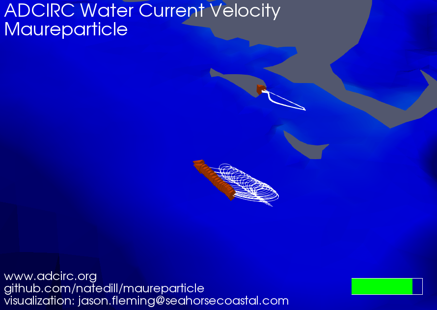

# Maureparticle

Maureparticle is a 2D particle tracking program that reads ADCIRC ascii 
water current velocity output files (fort.64) and optionally ADCIRC ascii
wind velocity output files fort.74 and performs particle tracking. 

[](https://asgs-static-assets.sfo2.digitaloceanspaces.com/web/maureparticle.gif "Maureparticle visualization - click to watch")
Click image above for animated visualization.


# The Maureparticle Example

1. Compile the `Maureparticle.f` and `BUILD_TABLES.f` programs. e.g.
```     
    gfortran -o maurept.exe Maureparticle.f
    gfortran -o buildtables.exe BUILD_TABLES.f, or use buildTables.pl, its faster
```

2. Move the executables and change directory into the example directory.

4. Run the BUILD_TABLES program to generate the NODE2EL.TBL and 
EL2EL.TBL files required by Maureparticle. You can do this before 
ADCIRC has been run since it only needs the FORT.14 file. The EL2EL 
table can be slow to generate for large grids. **Use the buildTables.pl 
perl script instead, it is much faster.** Set PERL5LIB to add the path to 
your local clone of the [ourPerl 
repository](https://github.com/natedill/ourPerl).   

3. Run the example ADCIRC simulation. This is a short run on the ec_95d 
grid with tides and a constant ENE wind. On linux or Mac you may need 
to make symbolic links in lower case to the all caps file names (e.g. 
`ln -s FORT.14 fort.14` because ADCIRC will look for lower case 
filenames on these case-sensitive platforms.

5. Now run the Maureparticle executable. It generates a file called 
MAUREPT.OUT that contains the particle ID, X,Y location, time, and the 
element the particle is in. 

6. For Google Earth visualization, install the perl GD module and then 
run the ParticlesOut_2_kml.pl Perl script to generate a kmz file to 
view the results in Google Earth.

7. Check out the PARTICLES.INP input file. Try some different 
parameters. it should be self-explanatory. 

# Maureparticle Parameters
                                                               
PARTICLES.INP is a required input file that contains information about 
run timing, tracking method, and starting particle positions and time. 
I tried to make it similar to the fort.15 in format, where each line is 
read from file with some particular fortran format and comments after 
an exclamation point are ignored.   

Here is a bit more description about the parameters in that file. 
 
All lines are required input, but may be ignored depending on context. 

1. **DESC** An 80 character description - put whatever you want here it doesn't do anything.

2. **NP** - This is the number of particles to track (i.e. the minimum 
number of starting positions listed at the end of the file starting at 
line 14).  You can actually include more starting particle lines in the 
file, but Maureparticle will only read and track NP of them.  If you 
list fewer than NP particle positions, Maureparticle will not run.

3. **TS** - The tracking time step in seconds. You'll want to make the 
time step small enough so that  particles won't travel more than the 
grid spacing in a single timestep.  If you make the timestep too big 
the particle may get "lost".  
         Maureparticle does not try to adaptively step through time 
         like some other particle tracking schemes. It just uses a 
         constant time step. Smaller grids will require smaller 
         timesteps, but typically you can use a larger timestep than 
         used in the ADCIRC simulation. 

4. **RUNTIM** - This is the duration of the particle tracking run in 
         seconds.  The model runs for int(RUNTIM/TS) tracking steps. 
         The run will stop RUNTIM seconds after it starts.  Note this 
         is different than RNDAY in ADCIRC (on a hotstart) were RNDAY 
         gives the time at which the run stops.  In Maureparticle, the
         run will stop when the time gets to  STDY_TIME + RUNTIM 
         seconds. 

5. **OUTPER** - This is the period of time in seconds at which 
         Maureparticle writes output. e.g. setting OUTPER to 900 will 
         write output every 15 minutes. Be sure to set the TS so it 
         divides evenly into the OUTPER (otherwise output will never
         be written). 

6. **RK2** This parameter selects which tracking method to use. 
         Setting RK2 equal to 1 will apply 2nd order velocity 
         integration (Runge-Kutta 2nd order / mid point method).  
         Setting RK2 to any integer other than 1 will apply the Euler's
         method.   The RK2 method is recommended. RK2 is generally more
         accurate, but only slightly slower.

7. **DYN** - Indicates whether Maureparticle will use a single 
         velocity field snapshot for a steady-state simulation  
         (e.g. for drawing streamlines), or use a time varying velocity
         field (e.g. to draw pathlines). Setting DYN to 1 will use time
         varying velocity field.  Setting DYN not equal to 1 will apply
         the steady-state method.    Note: when using DYN = 1 
         Maureparticle interpolates the velocity components linearly in
         time at the tracking time step. 

8. **STEADY_TIME/START_TIME** - Maureparticle reads the fort.64 
        [and optionally fort.74] file until it encounters a time greater
         than or equal to this time in seconds.  For a steady-state run
         Maureparticle will apply the velocity field at that time as the
         single time constant field. For a dynamic run Maureparticle 
         will start the tracking loop at that time, however it will not
         actually start moving particles until they are released 
         according to their RLSTIME (see below).

9. **EDDY_DIF** - Eddy diffusivity  in dimensions of (L*L/T).  
         Maureparticle will apply a random walk adjustment to the 
         particle displacements to simulate diffusion if this value 
         is greater than zero.  The magnitude of random walk 
         displacement is related to the eddy diffusivity and the 
         tracking time step by. 
         Random_Displacement =  RAND * (EDDY_DIF * TS)**0.5,  
         where RAND is a uniformly distributed random number between 
         0 and 1.  Note:  Maureparticle uses the intrinic function 
         RANDOM_NUMBER, which is non-standard prior to the Fortran95 
         standard.  Because of this It is not totally portable, and I 
         have seen weird behavior with some compilers.  It seems to 
         work fine with recent version of gfortran and intel.  As of 
         revision on 6/3/2016 diffusivity is automtically turned off
         when a particle is an a dry element,  this was implemented
         in an attempt to prevent particles from randomly tracking
         across dry land.  When in a dry element, particles are still
         tracked without diffusion based on the interpolated velocity,
         which may be non-zero if the element has one or two wet nodes
         the idea is that still allowing non-diffusive tracking in
         partially dry elements (fully dry from ADCIRC perspective)
         will prevent particles from getting stuck on wet/dry 
         boundaries.

10. **NWS** -  Indicates whether or not to include additional particle
         displacement based on the wind velocity.  Wind is applied if 
         NWS is not equal to zero.  This is useful for tracking 
         particles that are drifting at or near the surface and are 
         subject to wind driven surface currents or directly subject to 
         wind drag at the surface.  If selected the fort.74 file must be
         provided and a fraction of the wind velocity is added to the 
         depth averaged current velocity from fort.64 to produce the 
         tracking velocity field. 

11. **WFACTOR** -  The fraction of the wind velocity that is added to 
          the depth averaged current velocity. this is required input, 
          but only used if NWS .NE. 0.    

12.  **ICS** - Same as ADCIRC,  ICS  = 1 to indicate that the model 
          grid is in Cartesian coordinattes, or ICS = 2 to indicate the 
          grid is in geographic coordinates. 

13. **SLAM0, SFEA0** - same as ADCIRC.  when ICS equals 2 (geographic 
          coordinate grids) Maureparticle uses the CPP projection 
          (same projection used in ADCIRC) to transform to Cartesian 
          Coordinates SLAM0 and SFEA0 are the longitude and latitude 
          used for the origin of the CPP projection. 

14.  **XP,YP, RLSTIME, LOCAT**  - The following lines (14 thru 14+NP)
          include the stating position (XP, YP release time (RLSTIME), 
          and starting element(LOCAT) for each particle to be tracked.  
          XP and YP must be given in the same coordinate system as the 
          grid file (e.g. this will be longitude,latitude for ICS=2).  
          RLSTIME is time in seconds after which the particle is first 
          allowed to move.  LOCAT is the element ID number (JE) in
          which the particle starts.  It is not necessary to specify 
          the correct number for LOCAT.  If the correct element 
          number is not supplied Maureparticle will find the correct 
          number anyway, so generally one can use LOCAT=0 for all 
          particles.  However, if LOCAT is known, perhaps in the 
          output from a previous simulation, it can save some 
          simulation time by eliminating the need to perform an 
          initial particle search.  
